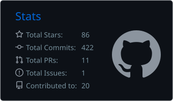
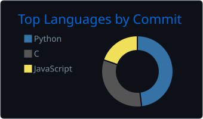

<picture>
  <source media="(prefers-color-scheme: dark)" srcset="./assets/capsule-wave-header-dark-fast.svg" />
  <source media="(prefers-color-scheme: light)" srcset="./assets/capsule-wave-header-light-fast.svg" />
  
</picture>

  

  

## 🛠️ Tech Stack

  <picture>
    <source media="(prefers-color-scheme: dark)" srcset="https://skillicons.dev/icons?i=python%2Cjava%2Cts%2Crust%2Ccpp%2Cflutter%2Cdocker%2Clinux%2Cgit%2Cgithub%2Cvscode%2Clatex%2Cros&perline=7&theme=dark" />
    <source media="(prefers-color-scheme: light)" srcset="https://skillicons.dev/icons?i=python%2Cjava%2Cts%2Crust%2Ccpp%2Cflutter%2Cdocker%2Clinux%2Cgit%2Cgithub%2Cvscode%2Clatex%2Cros&perline=7&theme=light" />
    
  </picture>

## 📊 GitHub Stats

  <picture>
    <source media="(prefers-color-scheme: dark)" srcset="./profile-summary-card-output/github_dark/3-stats.svg" />
    <source media="(prefers-color-scheme: light)" srcset="./profile-summary-card-output/github/3-stats.svg" />
    
  </picture>
  <picture>
    <source media="(prefers-color-scheme: dark)" srcset="./profile-summary-card-output/github_dark/2-most-commit-language.svg" />
    <source media="(prefers-color-scheme: light)" srcset="./profile-summary-card-output/github/2-most-commit-language.svg" />
    
  </picture>

## 🏆 GitHub Trophies

  

## 🐍 Contribution Snake

  <picture>
    <source media="(prefers-color-scheme: dark)" srcset="https://raw.githubusercontent.com/kevinlasnh/kevinlasnh/output/github-snake-dark.svg" />
    <source media="(prefers-color-scheme: light)" srcset="https://raw.githubusercontent.com/kevinlasnh/kevinlasnh/output/github-snake.svg" />
    
  </picture>

## 📈 Activity Graph

  <picture>
    <source media="(prefers-color-scheme: light)" srcset="https://github-readme-activity-graph.vercel.app/graph?username=kevinlasnh&bg_color=00000000&color=57606A&line=0969DA&point=1E90FF&area=true&area_color=87CEEB&hide_title=true&border_color=D0D7DE&radius=8&height=300&grid=true" />
    <source media="(prefers-color-scheme: dark)" srcset="https://github-readme-activity-graph.vercel.app/graph?username=kevinlasnh&bg_color=00000000&color=E6F7FF&line=00BFFF&point=00D4FF&area=true&area_color=1E90FF&hide_title=true&border_color=FFFFFF&radius=8&height=300&grid=true" />
    
  </picture>

## 🤝 Connect with Me

&#8194;&#8194;

<picture>
  <source media="(prefers-color-scheme: dark)" srcset="./assets/capsule-wave-footer-dark-fast.svg" />
  <source media="(prefers-color-scheme: light)" srcset="./assets/capsule-wave-footer-light-fast.svg" />
  
</picture>
